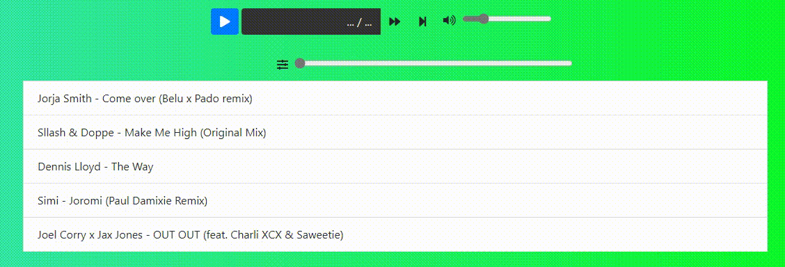

# Player Audio

Demo: https://acovalcic.github.io/PlayerAudio/

Aplicatie ce permite redarea de piese audio. Printre caracteristicile acesteia se numara posibilitatea reluarii redarii dupa redeschidere, afisarea timpului curent si total al piesei, navigarea in interiorul piesei cu ajutorul unui control vizual, modificarea volumului cu ajutorul unui control vizual, redarea automata a piesei urmatoare dupa terminarea celei curente.

## Prezentarea interfetei

## Testarea aplicatiei

 *Declinarea responsabilitatii: Eu, in calitate de creator al acestei aplicatii, nu detin drepturi asupra niciunei dintre melodiile utilizate in cadrul ei. Toate drepturile apartin proprietarilor lor. Nu se intentioneaza incalcarea drepturilor de autor deoarece au fost utilizate in scop educativ, pentru a testa functionalitatile aplicatiei de fata.
 (Disclaimer: I, as the creator of this app, do not own the rights to any of the music used within it. All rights belong to their respective owners. No copyright infringement intended because the songs have been used with educational purpose, to test the functionalities of this app.)